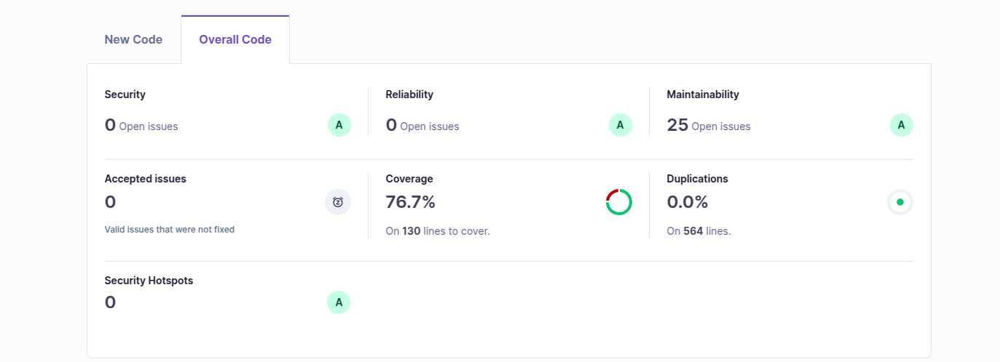

# 🌟 GitHub Repository Searcher

The **GitHub Repository Searcher** is a **Spring Boot** application that allows users to search for GitHub repositories via the **GitHub REST API**. The application stores search results in a **PostgreSQL database** and provides an API to retrieve stored results with filtering and sorting options.

---

##  Features

✅ Search **GitHub repositories** by query, language, and sorting criteria.  
✅ **Store search results** in a PostgreSQL database.  
✅ **Retrieve stored repository data** with filtering options.  
✅ **Robust error handling** for API failures and invalid requests.  
✅ **RESTful API** design with JSON responses.

---

## Technologies Used

- **Backend:** Spring Boot, Java
- **Database:** PostgreSQL
- **Testing:** JUnit, Mockito
- **Tools:** Maven, IntelliJ IDEA, Postman

---

## ⚙️ Installation & Setup

### Prerequisites

Ensure the following are installed:

- **Java 17+**
- **PostgreSQL** (installed and configured)
- **Maven** (installed)

###  Repository Setup

Clone the repository and navigate into the project directory:

```sh
git clone https://github.com/Amruta24818/github-repository-searcher.git
cd github-repository-searcher
```

###  Configure Database Connection

Update `application.properties` with your PostgreSQL credentials:

```properties
spring.datasource.url=jdbc:postgresql://localhost:5432/database_name?currentSchema=schema_name&allowPublicKeyRetrieval=true&useSSL=false&createDatabaseIfNotExist=true
spring.datasource.username=username
spring.datasource.password=password
spring.jpa.properties.hibernate.default_schema=schema_name
```

###  Build and Run the Application

Navigate to the root of the project via command line and execute:

```sh
mvn spring-boot:run
```

---

##  API Endpoints

### 1️.Search GitHub Repositories

- **Endpoint:** `POST /api/github/search`

#### 🔹 Request Body:

```json
{
  "query": "spring boot",
  "language": "Java",
  "sort": "stars"
}
```

#### 🔹 Response:

```json
{
  "message": "Repositories fetched and saved successfully",
  "repositories": [
    {
      "id": 123456,
      "name": "spring-boot-example",
      "description": "An example repository for Spring Boot",
      "owner": "user123",
      "language": "Java",
      "stars": 450,
      "forks": 120,
      "lastUpdated": "2024-01-01T12:00:00Z"
    }
  ]
}
```

---

### 2️.Retrieve Stored Results

- **Endpoint:** `GET /api/github/repositories`
- **Query Parameters (Optional):**
   - `language`
   - `minStars`
   - `sort` (`stars`, `forks`, `updated`)

#### 🔹 Example Request:

```sh
GET /api/github/repositories?language=Java&minStars=100&sort=stars
```

#### 🔹 Response:

```json
{
  "repositories": [
    {
      "id": 123456,
      "name": "spring-boot-example",
      "description": "An example repository for Spring Boot",
      "owner": "user123",
      "language": "Java",
      "stars": 450,
      "forks": 120,
      "lastUpdated": "2024-01-01T12:00:00Z"
    }
  ]
}
```

---

##  Testing

Run unit tests with:

```sh
mvn test
```
---
## SonarQube




---

##  Author

**Amruta**  
_GitHub Repository Searcher_

---

  